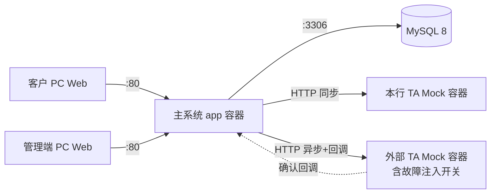
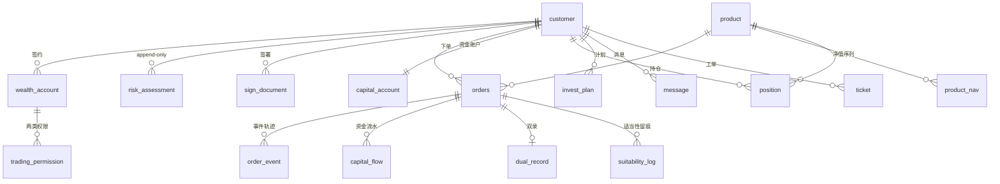

# 理财产品销售平台 · 主线一技术设计文档

> 术语以 `CONTEXT.md` 词汇表为准；架构决策以 `docs/decisions/` ADR 为准，本文直接引用不重复论证。

## 1. 系统架构

### 1.1 部署拓扑（目标态，Phase 2）



四容器：主系统（对外 80）、MySQL 8（内部）、本行 TA Mock（内部）、外部 TA Mock（内部，故障注入开关：正常/超时/拒绝/延迟确认）。

### 1.2 分阶段运行时策略（本地 Mock 优先）

采用 Spring Profile 隔离的两阶段策略，**先本地跑通再容器化**：

| 维度 | Phase 1：本地启动测试（当前迭代） | Phase 2：交付部署 |
|------|----------------------------------|-------------------|
| Profile | `local` | `compose` |
| 数据库 | H2 内存库（`MODE=MySQL` 方言），种子数据经 `data.sql` 初始化 | MySQL 8 容器，同一套 DDL 与种子脚本 |
| 本行 TA | 进程内 Mock Bean（实现 `TaClient` 接口） | HTTP 容器（同一接口的 HTTP 实现） |
| 外部 TA | 进程内 Mock Bean（含故障注入开关） | HTTP 容器（异步确认 + 回调 + 故障注入） |
| 启动方式 | `./mvnw spring-boot:run`，零外部依赖 | `docker-compose up -d` |
| 业务代码 | 完全相同 | 完全相同 |

**契约一致性保障**：
- TA 访问统一走 `TaClient` 接口抽象（`subscribe` / `redeem` / `confirmCallback` 三个核心方法）；Phase 1 提供 `InProcessInternalTaClient` / `InProcessExternalTaClient`，Phase 2 提供 `HttpInternalTaClient` / `HttpExternalTaClient`，由 Profile 条件装配切换，签名与报文结构一致。
- 数据层统一经 Spring Data JPA，DDL 使用 H2/MySQL 兼容语法，实体零改动。

### 1.3 单体内部分层（DDD 轻量）

```
com.cib.ai.test
├── controller/        # 接口适配层：REST 端点、参数校验、响应封装
│   ├── customer/      #   C 端端点
│   └── admin/         #   管理端端点
├── service/           # 应用层：用例编排、事务边界
├── domain/            # 领域层：订单状态机、适当性规则、估值（不依赖 Spring/框架）
├── repository/        # 基础设施层：JPA 数据访问
├── model/             # DTO：入参出参对象
├── taclient/          # TA 边界：TaClient 接口 + local/compose 两套实现
└── config/            # 配置：安全拦截、Profile 装配、调度
```

依赖方向：`controller → service → domain`；domain 层不依赖任何外层（无 Spring 注解）。

### 1.4 前端结构

同一 React 工程，双路由分区：

```
src/
├── customer/          # C 端：登录、货架、下单、持仓、消息、投教
├── admin/             # 管理端：订单监控、净值发布、渠道、工单、健康矩阵
├── components/        # 通用组件
└── services/          # fetch 封装（统一 BASE_URL 与错误处理）
```

## 2. 技术栈声明（版本锁定）

| 层 | 组件 | 版本 |
|----|------|------|
| 后端语言 | Java | 17 |
| 后端框架 | Spring Boot（web / data-jpa / validation / actuator） | 3.3.5 |
| 数据库（交付） | MySQL | 8.x（镜像锁定 8.4） |
| 数据库（本地 Mock） | H2 | 随 Boot BOM，MODE=MySQL |
| 前端框架 | React + TypeScript | 19 / ~6.0 |
| 构建 | Vite / Oxlint | 8 / 1.81 |
| 构建 | Maven Wrapper | 随工程 |
| 部署 | Docker + Docker-Compose | 服务器自装版本 |

依据：ADR-0001（技术栈）、ADR-0007（MySQL 8）。依赖版本一律由 parent/BOM 管理，不写死 `<version>`。

## 3. 领域与数据模型

### 3.1 实体清单

| 实体 | 表 | 说明 |
|------|-----|------|
| 客户 | `customer` | 手机号、密码（BCrypt）、实名状态、尽调信息 |
| 管理端用户 | `operator` | 独立身份体系（ADR-0003），角色：OPERATION/CUSTOMER_SERVICE |
| 渠道 | `channel` | 渠道码、类型、核心/非核心、状态 |
| 理财账户 | `wealth_account` | 签约状态机：UNSIGNED→SIGNED→TERMINATED |
| 交易权限 | `trading_permission` | 每账户两行：PROPRIETARY / CONSIGNMENT |
| 风险测评 | `risk_assessment` | append-only 快照：答案、得分、C 等级、有效期起止 |
| 签署文件 | `sign_document` | 权益须知/风险告知/产品协议/代销揭示，签署留痕 |
| 产品 | `product` | 要素、R 等级、品类、起购、费率、额度、交易时段、自营/代销、发行方 |
| 净值 | `product_nav` | 每产品每估值日一条；代销行含外部来源与同步时间 |
| 订单 | `orders` | 单表 + product_type 区分（ADR 见 spec Q10），状态机字段 |
| 订单事件 | `order_event` | append-only 轨迹：状态迁移、TA 标识、报文流水号 |
| 资金账户 | `capital_account` | 可用余额、冻结余额 |
| 资金流水 | `capital_flow` | 幂等键（订单号+动作类型），动作：FREEZE/DEDUCT/UNFREEZE/RETURN |
| 份额持仓 | `position` | 产品份额、成本；乐观锁版本号 |
| 投资计划 | `invest_plan` | 预约申购/定投计划，@Scheduled 扫描触发 |
| 分红设置 | `dividend_setting` | CASH / REINVEST |
| 消息 | `message` | 站内信：净值/成交/到期/公告/投诉进度 |
| 工单 | `ticket` | 咨询/投诉；代销投诉含外部同步状态 |
| 双录 | `dual_record` | 代销 R4/R5 触发，Mock 标志文件 |
| 适当性留痕 | `suitability_log` | 每次校验结果：PASS/CONFIRM/BLOCK + 上下文 |
| 投教 FAQ | `faq` | LLM 降级知识库 |

### 3.2 ER 图（核心关系）



### 3.3 表设计要点

- **测评 append-only**：`risk_assessment` 只有 INSERT；应用层不提供 UPDATE/DELETE 入口；每次测评插入完整快照，历史全部可查（功能 5 不可篡改留痕）。
- **订单幂等**：`orders` 含 `client_request_id` 唯一键（前端生成），重复提交返回原订单。
- **资金流水幂等**：`capital_flow` 唯一键 `(order_no, action_type)`，同一订单同一动作不重复入账（ADR-0006）。
- **额度占用**：`product` 行内 `total_quota / used_quota`，`SELECT ... FOR UPDATE` 行锁控制并发占用/释放（MySQL InnoDB；H2 兼容）。
- **持仓乐观锁**：`position.version`，TA 确认更新份额时防并发覆盖。
- **事件轨迹**：`order_event` append-only，每次状态迁移插一条（from→to、TA 标识、报文流水号、时间戳）。

## 4. API 契约

约定：C 端前缀 `/api/customer`，管理端前缀 `/api/admin`；统一 JSON；错误返回 `{code, message}`。

### 4.1 C 端端点

| 域 | 端点 | 方法 | 语义 |
|----|------|------|------|
| 认证 | `/login` `/logout` `/me` | POST/POST/GET | 手机号密码登录（Session） |
| 账户 | `/account/sign` | POST | 签约理财账户+开通权限 |
| 账户 | `/account` | GET | 账户与权限状态 |
| 账户 | `/account/terminate` | POST | 解约（校验持仓/在途/费用，拒绝返回原因列表） |
| 准入 | `/assessment` | POST/GET | 提交测评 / 查最新等级与有效期 |
| 准入 | `/documents/{type}/sign` | POST | 电子签收四类文件 |
| 货架 | `/products` | GET | 统一货架，多条件筛选（功能 7/8） |
| 货架 | `/products/{id}` | GET | 详情：要素/费率/净值走势/公告/风险揭示（功能 9） |
| 交易 | `/orders/purchase` | POST | 申购（校验链+二次确认参数 `confirmRisk=true`） |
| 交易 | `/orders/redeem` | POST | 赎回 |
| 交易 | `/orders/{id}/cancel` | POST | 撤单（可撤时段校验） |
| 交易 | `/plans` | POST/GET/DELETE | 预约申购/定投计划 |
| 交易 | `/dividend-setting` | PUT | 现金分红/红利再投资 |
| 交易 | `/dual-record` | POST | 双录 Mock 上传（代销 R4/R5 前置） |
| 持仓 | `/positions` | GET | 统一持仓视图（自营/代销分区+在途） |
| 持仓 | `/positions/valuation` | GET | 估值与收益（口径一致，来源标注） |
| 服务 | `/flows` | GET | 交易流水（自营/代销分档，可导出 CSV） |
| 服务 | `/messages` | GET | 站内信 |
| 服务 | `/tickets` | POST/GET | 咨询/投诉工单 |
| 投教 | `/ai-qa` | POST | AI 问答（来源+风险声明+人工转接标记） |

### 4.2 管理端端点

| 域 | 端点 | 方法 | 语义 |
|----|------|------|------|
| 认证 | `/admin/login` | POST | 管理端登录（独立 Session） |
| 订单 | `/admin/orders` | GET | 统一订单查询（自营/代销、状态、路由链路） |
| 订单 | `/admin/orders/{id}/events` | GET | 订单事件轨迹 |
| 净值 | `/admin/nav/publish` | POST | 自营净值发布 |
| 渠道 | `/admin/channels` | CRUD | 渠道登记与差异化管理 |
| 工单 | `/admin/tickets` | GET/PUT | 受理处置；代销投诉外部同步 |
| 客户 | `/admin/customers/{id}/assessments` | GET | 测评历史（append-only 审计） |
| 运维 | `/admin/health/matrix` | GET | 组件矩阵（DB/本行 TA/外部 TA） |

健康检查双端点：`/actuator/health`（Compose healthcheck）+ `/admin/health/matrix`（自定义组件矩阵）。

## 5. 订单状态机

### 5.1 状态定义

| 状态 | 含义 | 是否终态 |
|------|------|----------|
| CREATED | 已创建，校验通过待提交 | |
| SUBMITTED | 已提交 TA | |
| TA_ACCEPTED | TA 受理 | |
| CONFIRMED | TA 确认（申购份额/赎回份额扣减） | |
| SETTLED | 申购资金结清 | ✔ |
| REDEEMED | 赎回资金回款 | ✔ |
| CANCELLED | 撤单成功 | ✔ |
| FAILED | 校验失败 / TA 拒绝 | ✔ |
| EXPIRED | 预约计划作废 | ✔ |
| PENDING_QUEUE | 巨额赎回延期确认 | |
| REVERSED | 冲正（预留枚举，本阶段不实现） | ✔ |

### 5.2 迁移表

| From | 事件 | Guard | To | 动作 |
|------|------|-------|-----|------|
| — | 创建订单 | 校验链通过 | CREATED | 冻结资金（申购）/ 冻结份额（赎回）、占额度 |
| CREATED | 提交 TA | 可撤时段内或已过 | SUBMITTED | 写 order_event（TA 标识+报文流水号） |
| SUBMITTED | TA 受理 | — | TA_ACCEPTED | 事件留痕 |
| TA_ACCEPTED | TA 确认 | 非巨额超限 | CONFIRMED | 扣划资金/扣减份额、释放额度、写持仓 |
| TA_ACCEPTED | 巨额赎回判定 | 单日超产品阈值 10% | PENDING_QUEUE | 超限部分标记延期 |
| PENDING_QUEUE | T+1 调度触发 | — | CONFIRMED | 同确认动作 |
| CONFIRMED | 资金结清 | 申购 | SETTLED | 资金流水 DEDUCT |
| CONFIRMED | 回款到账 | 赎回 | REDEEMED | 资金流水 RETURN + 份额最终扣减 |
| CREATED/SUBMITTED | 客户撤单 | 可撤时段内 | CANCELLED | 解冻资金/份额、释放额度 |
| 任意非终态 | 校验失败/TA 拒绝 | — | FAILED | 解冻、释放额度、消息通知 |

约束：状态只进不退；每次迁移插一条 `order_event`；终态后订单不可再变更（除预留 REVERSED 冲正通道）。

## 6. TA Mock 接口契约

### 6.1 TaClient 接口抽象

```java
interface TaClient {
    TaResult subscribe(OrderCommand cmd);      // 申购指令
    TaResult redeem(OrderCommand cmd);         // 赎回指令
    void confirmCallback(TaCallback cb);       // 确认回调（外部 TA 异步）
}
```

### 6.2 本行 TA（同步确认）

`POST /ta/internal/subscribe`、`POST /ta/internal/redeem`：请求含订单号、产品码、金额/份额、客户号；**同步返回**受理+确认结果（份额按最新净值计算）。自营订单提交即完成 CONFIRMED。

### 6.3 外部 TA（异步确认 + 回调 + 故障注入）

- `POST /ta/external/subscribe|redeem`：受理即返回 `ACCEPTED`，不返回最终确认。
- 回调：外部 TA 异步调用主系统 `POST /api/callback/ta-external/confirm`，报文含订单号、确认份额、确认状态；主系统按报文流水号去重（重复回调幂等处理）。
- **故障注入开关**（Mock 管理端点 `/ta/external/fault-mode`）：`NORMAL` / `TIMEOUT`（挂起 30s） / `REJECT`（受理后拒绝） / `DELAY_CONFIRM`（延迟 60s 回调）。

### 6.4 报文流水号规范

`{TA标识}-{日期 yyMMdd}-{8 位序列}`，如 `EXTA-260915-00000001`；每笔交互生成，写入 order_event 支撑追溯。

### 6.5 差错矩阵 → 处理机制

| 差错场景 | 处理机制 |
|----------|----------|
| 申购资金处理失败 | 订单置 FAILED，解冻资金，消息通知 |
| 外部 TA 通信异常 | 超时重试 3 次（指数退避），仍失败转人工工单 |
| 外部交易结果未知 | 订单停留 TA_ACCEPTED，定时轮询查询，超时告警 |
| 重复提交/重复回调 | client_request_id / 报文流水号幂等去重 |
| 对账差异 | 订单-资金流水-持仓三方核对任务，差异生成工单 |
| 巨额赎回 | PENDING_QUEUE 延期确认（5.2） |
| 净值异常 | 净值偏离阈值拦截发布，人工复核 |
| 双录缺失 | 校验链拦截，不得继续交易 |
| 资金与份额不一致 | 冲正预留（REVERSED）+ 工单人工处理 |
| 外部接口故障 | 故障注入开关演示：熔断降级 + 告警 + 恢复 |

## 7. 适当性引擎

独立 service，数据驱动 C×R 映射：

| C\R | R1 | R2 | R3 | R4 | R5 |
|----|----|----|----|----|----|
| C1 | PASS | CONFIRM | BLOCK | BLOCK | BLOCK |
| C2 | PASS | PASS | CONFIRM | BLOCK | BLOCK |
| C3 | PASS | PASS | PASS | CONFIRM | BLOCK |
| C4 | PASS | PASS | PASS | PASS | CONFIRM |
| C5 | PASS | PASS | PASS | PASS | PASS |

- **PASS** 直接通过；**CONFIRM** 返回风险提示，前端二次确认（`confirmRisk=true` 重提交）后通过并留痕；**BLOCK** 拦截。
- 前置校验：测评有效期（过期强制重测）、客户范围、产品开放状态。
- 每次校验写 `suitability_log`（结果+客户等级+产品等级+时间），管理端可查。

## 8. 种子数据设计

### 8.1 客户矩阵（6 个）

| 账号 | 等级/状态 | 演示场景 |
|------|-----------|----------|
| cust_c1 | C1，已签约双权限 | 适当性 BLOCK 拦截（买 R3+） |
| cust_c3 | C3，已签约双权限 | CONFIRM 二次确认分支（买 R4） |
| cust_c4 | C4，已签约双权限 | PASS 正常申购 |
| cust_c5 | C5，已签约双权限 | 高风险产品可购 + 巨额赎回演示 |
| cust_expired | C4，**测评已过期** | 到期强制重测拦截 |
| cust_unsigned | 未测评未签约 | 准入链路全流程演示 |

### 8.2 产品矩阵（8 只）

| 产品 | 类型 | R 等级 | 特点 |
|------|------|--------|------|
| P-PR-01 | 自营 | R1 | 低风险货基型，起购 1 元 |
| P-PR-02 | 自营 | R3 | 固收，起购 1 万 |
| P-PR-03 | 自营 | R4 | 混合，起购 10 万 |
| P-PR-04 | 自营 | R5 | 股票型，额度紧张（演示额度拦截） |
| P-CS-01 | 代销 | R2 | 基金公司 A，R2 |
| P-CS-02 | 代销 | R3 | 基金公司 A |
| P-CS-03 | 代销 | R4 | 信托公司 B（触发双录） |
| P-CS-04 | 代销 | R5 | 券商 C（触发双录 + 高风险提示） |

每只产品 30 个估值日净值（含小幅波动曲线）；cust_c4/cust_c5 预置存量持仓与在途订单（演示统一持仓视图）。

### 8.3 管理端账号（2 个）

`admin_op`（运营岗：订单/净值/渠道/健康）、admin_cs`（客服岗：工单）。

### 8.4 载入方式

Phase 1：`data.sql` 在 H2 启动时执行（schema + seed 一体）；Phase 2：同一脚本由 MySQL 容器 init 目录执行。

## 9. 部署与端口声明

### 9.1 Phase 1：本地启动测试（当前）

```bash
cd backend && SPRING_PROFILES_ACTIVE=local ./mvnw spring-boot:run
# H2 内存库 + 进程内 TA Mock，零外部依赖
cd frontend && npm run dev   # Vite 代理 /api → :8080
```

### 9.2 Phase 2：docker-compose 服务清单

| 服务 | 镜像 | 端口 | 用途 |
|------|------|------|------|
| app | 自建（多阶段构建） | 80 → 8080 | 主系统（前端静态资源由 Nginx 或 app 托管） |
| mysql | mysql:8.4 | 3306（内部） | 数据库 |
| ta-internal | 自建 Mock | 内部 | 本行 TA |
| ta-external | 自建 Mock | 内部 + 管理端口 | 外部 TA + 故障注入 |

对外仅 80（应用入口）；GitLab 8443 为赛事仓库服务，与本系统部署无关（设计文档部署声明章节按要求另列）。

### 9.3 健康检查

- `/actuator/health`：Compose healthcheck 与评审用例。
- `/api/admin/health/matrix`：组件矩阵（DB / 本行 TA / 外部 TA 各自状态），外部 TA 探测复用故障开关，可演示"外部接口故障告警"。

## 10. 质量属性与 SLO

| 属性 | SLO / 口径 | 落点 |
|------|-----------|------|
| 性能 | 货架查询 p95 < 200ms；申购提交 p95 < 500ms；持仓视图 p95 < 300ms（本地/单机口径） | 索引设计、净值缓存 |
| 幂等 | 资金动作重复执行 0 次副作用 | capital_flow 唯一键、client_request_id、回调流水号去重 |
| 一致性 | 订单-资金流水-持仓三方核对零差异 | 对账查询 + 差异工单 |
| 可追溯 | 每笔订单全生命周期事件可查 | order_event append-only |
| 可靠性 | TA 超时/未知结果不产生脏数据 | 状态机约束 + 重试 + 轮询 |
| 可运维 | 健康检查双端点；日志结构化输出 | Actuator + 组件矩阵 |

## 11. 安全设计

- **双身份 Session**（ADR-0003/0004）：C 端与管理端独立登录端点；Session 属性标记身份类型；`/api/customer/**` 仅客户 Session 可访问，`/api/admin/**` 仅管理端 Session，越权 403。
- **密码**：BCrypt 哈希存储；种子数据不含真实 PII。
- **敏感信息不入库**：配置经环境变量注入 compose；仓库无密钥。
- **纪律红线**：代码与文档不含公司/中心名称、logo、ID。

## 12. 需求映射表（17 功能）

| # | 功能 | 承载模块 | 关键 API | spec 故事 |
|---|------|----------|----------|-----------|
| 1 | 多渠道接入 | channel + 拦截器 | `/admin/channels` | 1,2 |
| 2 | 统一登录认证 | AuthController(customer) | `/login` `/logout` | 3,4 |
| 3 | 实名与尽调 | customer 域 + Mock 人脸 | `/account/sign` 前置 | 5,6 |
| 4 | 账户签约与权限 | WealthAccountService | `/account/*` | 7,8 |
| 5 | 风险测评 C1-C5 | RiskAssessmentService | `/assessment` | 9,10,11 |
| 6 | 适当性档案与签署 | SignDocumentService | `/documents/*/sign` | 12 |
| 7 | 统一货架标识 | ProductService | `/products` | 13,14 |
| 8 | 筛选搜索对比 | ProductService | `/products` | 15 |
| 9 | 详情净值披露 | ProductService + NAV | `/products/{id}` | 16,17 |
| 10 | 申购与路由 | OrderService + TaClient | `/orders/purchase` | 18,19,24 |
| 11 | 赎回与路由 | OrderService + TaClient | `/orders/redeem` | 20 |
| 12 | 撤单/预约/定投/分红 | OrderService + InvestPlan + Scheduler | `/orders/*/cancel` `/plans` `/dividend-setting` | 21,22,23 |
| 13 | 统一持仓视图 | PositionService | `/positions` | 25 |
| 14 | 估值与收益 | ValuationService（domain） | `/positions/valuation` | 26 |
| 15 | 流水/公告/消息 | MessageService | `/flows` `/messages` | 27,28 |
| 16 | 客服投诉工单 | TicketService | `/tickets` | 29,31 |
| 17 | 投教 AI 问答 | AiQaService（LLM+FAQ） | `/ai-qa` | 30 |
| — | 端到端主链路 | 上述组合 | 种子账号 cust_c4 | 35,36,37 |

## 13. 本地启动验证记录（Phase 1）

> 2026-09-16 实际执行。第一轮验证骨架环境；第二轮验证 Phase 1 local Profile 落地（H2 + 进程内 TA Mock）。

### 13.1 骨架环境（第一轮）

| 项 | 结果 |
|----|------|
| 后端 `./mvnw spring-boot:run` 启动 | ✅ 通过（Tomcat 8080，1.4s 启动，无报错） |
| `GET /api/hello` 冒烟 | ✅ HTTP 200，`{"message":"Hello from Spring Boot!","time":"..."}` |
| 前端 `npm run dev` | ✅ Vite 8.3.0 ready（357ms），`http://localhost:5173/` HTTP 200 |

### 13.2 local Profile 落地（第二轮，2026-09-16）

| 项 | 结果 |
|----|------|
| `local` Profile 默认激活（application.yml） | ✅ 启动日志 `The following 1 profile is active: "local"` |
| H2 内存库（MODE=MySQL） | ✅ `jdbc:h2:mem:wealth` 连接池启动，H2 Console 可用 |
| 进程内双 TA Mock 装配 | ✅ InProcessInternalTaClient / InProcessExternalTaClient（@Profile("local")） |
| 集成测试（8 项） | ✅ 全部通过：H2 方言契约、本行 TA 同步确认（申购/赎回）、外部 TA 正常受理+异步回调、延迟确认、拒绝、超时异常、重复回调幂等去重 |
| `spring-boot:run` + curl 冒烟 | ✅ HTTP 200 |
| `./scripts/verify.sh` | ✅ 后端编译/测试 + 前端 lint/build 全部通过 |

代码位置：`backend/src/main/java/com/cib/ai/test/taclient/`（TaClient / ExternalTaClient 接口、OrderCommand / TaResult / TaCallback 报文、TaSerialGenerator 流水号、FaultMode 故障开关、进程内双 Mock）；测试 `backend/src/test/java/com/cib/ai/test/taclient/InProcessTaClientTest.java`。
